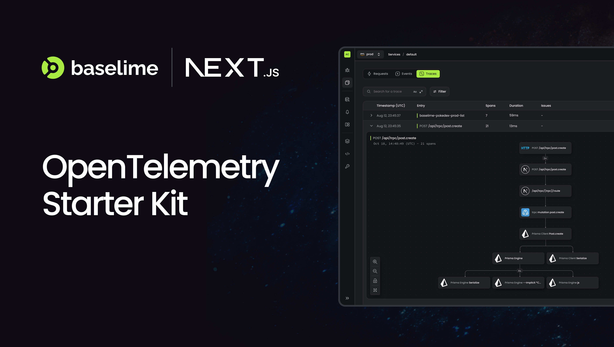
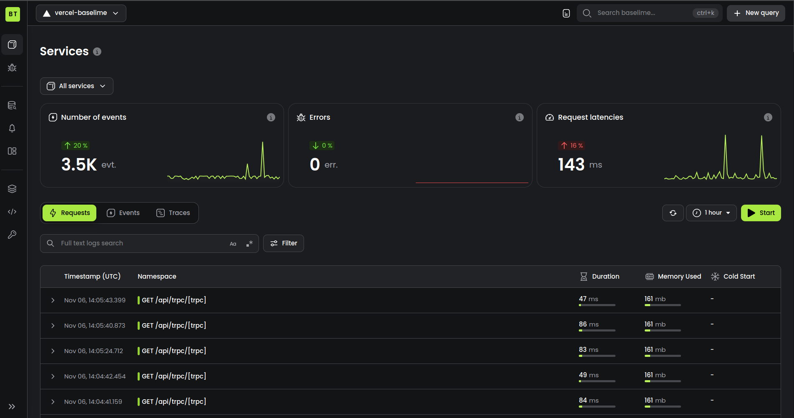
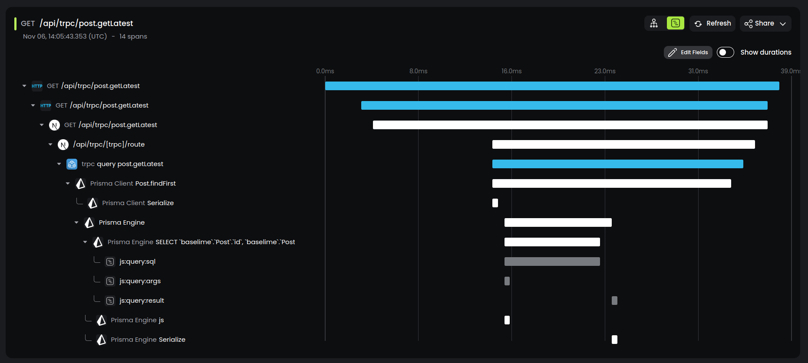

# Next.js Baselime Template with OpenTelemetry



This is a [Next.js](https://nextjs.org/) project instrumented with [OpenTelemetry](https://opentelemetry.io/) and [Real User Monitoring](https://baselime.io/docs/sending-data/react-rum/) and sending logs and traces to [Baselime](https://console.baselime.io).

## Deployment

This project is deployed to Vercel

[](https://vercel.com/new/clone?repository-url=https%3A%2F%2Fgithub.com%2Fbaselime%2Fbaselime-nextjs-template&project-name=next-baselime-opentelemetry&repository-name=next-baselime-opentelemetry&demo-title=Baselime&demo-description=See%20the%20deployed%20data%20for%20this%20project&demo-url=https%3A%2F%2Fsandbox.baselime.io%2Fbaselime%2Fvercel-baselime%2Fdefault%2Fhome&demo-image=https%3A%2F%2Fgithub.com%2Fbaselime%2Fbaselime-nextjs-template%2Fraw%2Fmain%2Fassets%2Fog.png&integration-ids=oac_Giinlv0yMW9d97AysfaDTS6z)

## Logging

This template will automatically install the [Baselime Vercel Integration](https://vercel.com/integrations/baselime) which will setup a log drain to automatically capture all the logs from your Vercel projects.



## Distributed Tracing With OpenTelemetry

This template is instrumented with the [Baselime OpenTelemetry SDK for Next.js](). This instrumentation will automatically capture distributed traces from your Next.js application and export them to Baselime for analysis.




## Instructions

First, run the development server:

```bash
npm run dev
# or
yarn dev
# or
pnpm dev
# or
bun dev
```

Open [http://localhost:3000](http://localhost:3000) with your browser to see the result.

You can start editing the page by modifying `app/page.tsx`. The page auto-updates as you edit the file.

## Learn More

* To learn more about baselime go do the [docs](https://baselime.io/docs/)
* To see the deployed applications logs, and traces go to the [Baselime Console](https://console.baselime.io)
